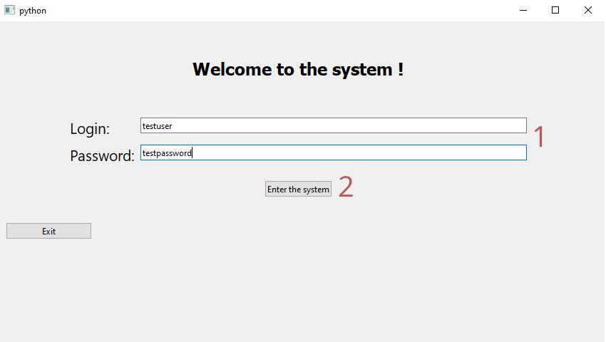
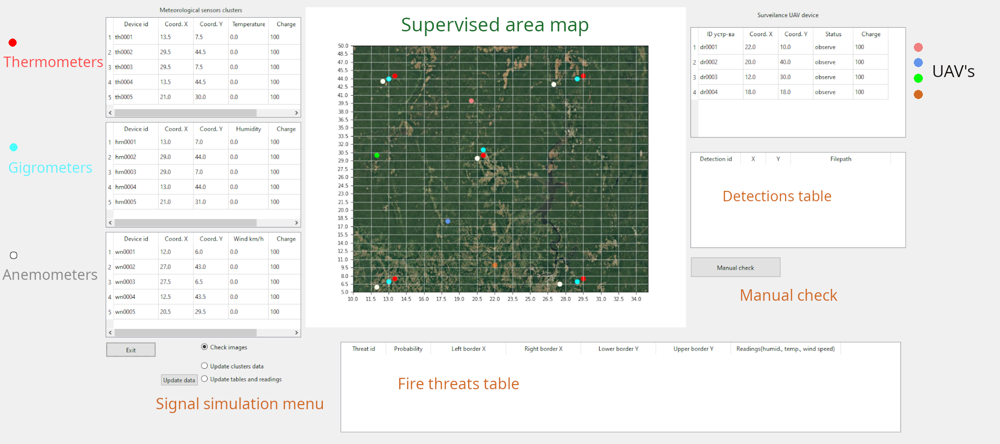
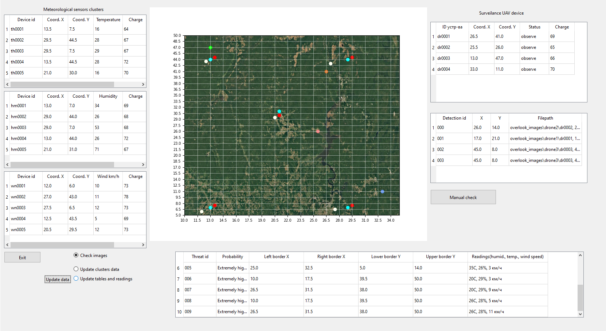
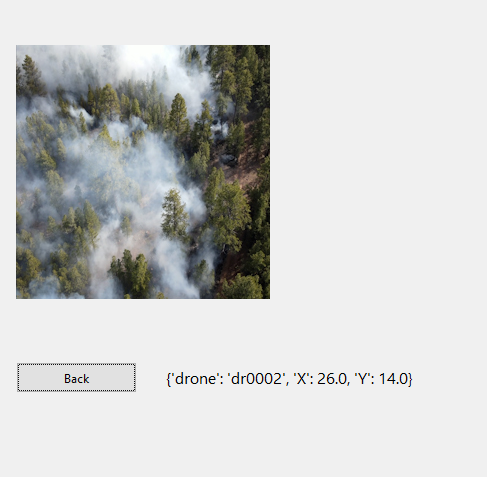
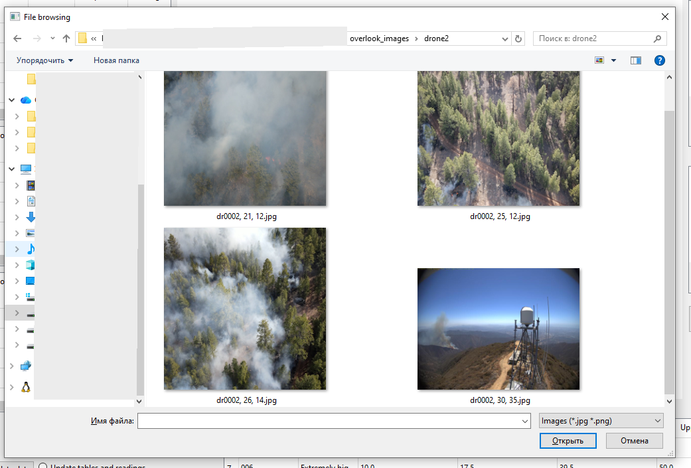
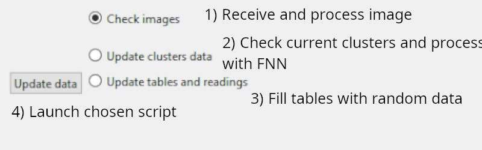

# Python + Qt + Keras Wildfire Detection small Information System

## A "proof of concept" system, dedicated to the use of fully synthetic training dataset with keras CNN model and inference on wildfire detection with simple GUI in PyQt6.

This is a small information system I developed as a CS Masters Dissertation project, dedicated to the prospects of usage of synthetically generated images as training data for Convolutional Neural Networks (CNN) in the tasks of fire detection in forest regions. Additionally, it implements a small FNN model to predict fire risk areas using data from scalar sensors. 

> [!WARNING]
> As-Is, this system function as demo. Below is more on that. 

This project was created as a proof of concept and does not function "out of the box". It _mimics_ receival of data from external sources (e.g. UAV drones or scalar weather sensors) using randomized data <ins>within</ins> code or <ins>predownloaded</ins> images. 

## Alleged Functions
* Login window (no encryption yet)
* Main menu with tables of data of sensors as well as UAVs with location, measurements and battery charge stored within *.json* files
* 1 CNN for fire detection (classification task)
* 1 Feed Forward Network (FNN) for fire risk prediction using: 
  - humidity (%) 
  - temperature (oC) 
  - wind speed (km/h)
* Receiving an image with coordinates from UAV and processing it with CNN for possible fire detection
* Scanning scalar sensors clusters for weather data and passing it to a FNN network for processing and risk asessment in certain zone
* Button for manual "double-checking" by the user for further actions

## What <ins>needs</ins> to be done for real deployment
* Password encryption (and database) or login window removed if no security required
* Code for connecting real monitoring devices for information system with transmission of required parametes to the code
* Coordinates span as well as satelite image of supervised region for the map for easier monitoring
* If possible, conversion of code or tweaks for easier deployment (maybe Docker :whale: image)

## GUI user manual
1. Entering the program (insert credentials as shown) 

2. Main menu with initial data loaded (icons for simpler perception) 

3. Main menu with "updated" data 

4. Automatic detection notification window (will pop up if the CNN classifies image as positive) 

5. Manual check window (user can manually look through recent detections 

6. Small menu for simulation the signal that should be sent by external devices (before #2 its better to run #3 for better results, #1 is independent) 

## Preparations
### 1) You need Python 3.13 or higher with pip installed
### 2) Clone this repository to your designated folder
    git clone https://github.com/Maksim-Karpov/Wildfire-Detection-System
### 3) Inside new folder install additional packages from "project_dependencies.txt" with
    pip install -r project_dependencies.txt
### 3) Download 2 .keras neural networks from this Kaggle repository:
### 3.1) Fire detection 
        https://www.kaggle.com/models/maximkarpovivn/wildfire-image-detection-model
### 3.2) Fire prediction 
        https://www.kaggle.com/models/maximkarpovivn/wildfire-prediction-model
### Here is also the synthetically made training dataset made with blender (download optional):
    https://www.kaggle.com/datasets/maximkarpovivn/small-wildfire-synthetic-dataset/data
### 4) Create folders in the same path as all files (main.py, LoadAiModels.py, etc)
### so that it looks like this: /neural_networks/Image Model/
### Then add downloaded image classification model, so that full path will look like this:
    /neural_networks/Image Model/Models/wildfire_image_classification_v1_local.keras
### 5) Do the same for: /neural_networks/Numeric Model/
### In the end for FNN model the path should look like this:
    /neural_networks/Numeric Model/Weather_parameters_model_firebias_v1.keras
### 6) You should be good to go :)
